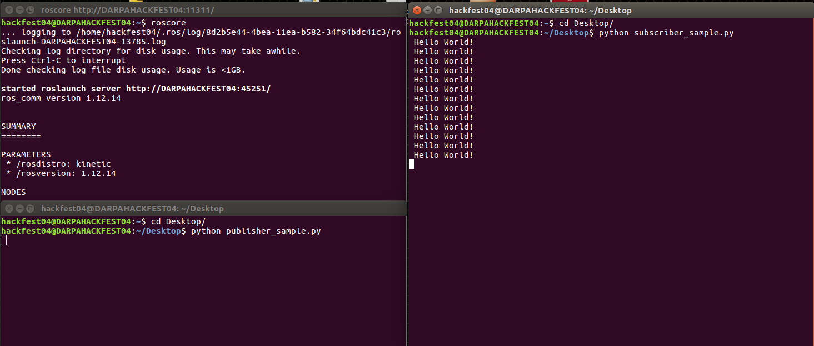

# Creating my own ROS program

Since we have already familiarized with both ROS and Gazebo, it is time to write our own program. 

### Sample Publisher and Subscriber

Let's start with creating sample publisher and subscriber. 

***Publisher:***

```python
#!/usr/bin/env python
import rospy
from std_msgs.msg import String
rospy.init_node('my_pub')
pub = rospy.Publisher('my_topic', String, queue_size = 10)
topic_content = ' Hello World! '
rate = rospy.Rate(1)
while not rospy.is_shutdown():
	simple_publisher.publish(topic_content)
	rate.sleep()
```

* The first line `#!/usr/bin/env python` is known as the *shebag* which let the OS know it is a Python file. 
* The second line `import rospy` appears in every ROS Python node and imports all basic functions. 
* The next line `from std_msgs.msg import String` imports the definition of the message we are going to use for the topic. In our case, we will be using *String* to publish a topic. 
* After initializing the node with `rospy.init_node('my_pub')`, we advertise it with a Publisher `pub = rospy.Publisher('my_topic', String, queue_size = 10)`. This gives the topic name (*my_topic*), specifies the type of message that will be sent over (*String*) and queue size (10).
* Now, we create a message that will be sent over the topic with `topic_content = ' Hello World! '`
* Now, we set the rate, in hertz, at which we want to publish.  `rate = rospy.Rate(1)`
For this example, we’re going to publish once a second.

At this point, the topic is advertised and is available for other nodes to subscribe to.
Now we can go about actually publishing messages over the topic.

* `while not rospy.is_shutdown()` returns True if the node is ready to be shut down and False otherwise, so we can use this to determine if it is time to exit the while loop
* Inside the while loop, we publish the topic and its content `topic_content`.
* Then, the call to `rate.sleep()` will sleep for long enough to make sure that we run the body of the while loop at approximately 1 Hz.

***Subscriber:***

```python
#!/usr/bin/env python
import rospy
from std_msgs.msg import String
def stringCallback(msg):
	print(msg.data)
rospy.init_node('my_sub')
rospy.Subscriber('my_topic', String, stringCallback)
rospy.spin()
```

* The function `stringCallback(msg)` prints the message over the topic. 
* Now, we initialize the node with `rospy.init_node('my_pub')`, and subscribe to the topic with `rospy.Subscriber('my_topic', String, stringCallback)`. We give the name of the topic, the message type of the topic, and the name of the callback function. 
* Once the subscription is made, we give control over to ROS by calling `rospy.spin()` .
This function will only return when the node is ready to shut down.


### Running Sample Publisher and Subscriber

First of all, save Publisher and Subscriber scripts above and save them on your *Desktop* as *publisher.py* and *subscriber.py*, respectively.

Then, we have to start `roscore`, so it shares its list of publishers and subscribers, which the nodes will then use to create direct connections between all publishers and of all subscribers to each topic. And run Python files (all in different terminals): 

>```sh
> $ roscore
> ~/Desktop$ python publisher.py
> ~/Desktop$ python subscriber.py
>```


