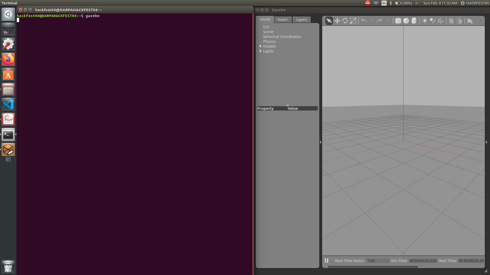
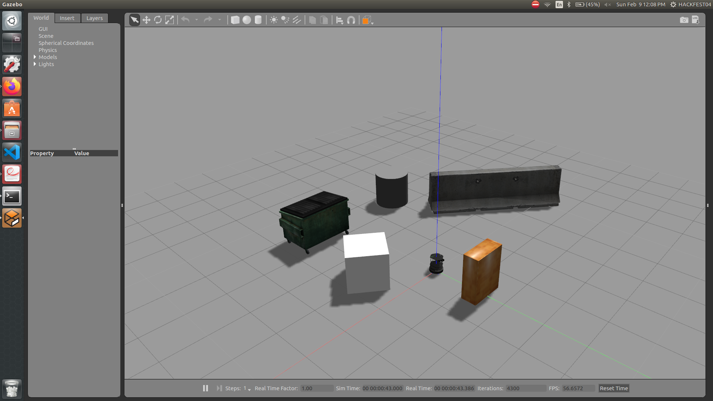
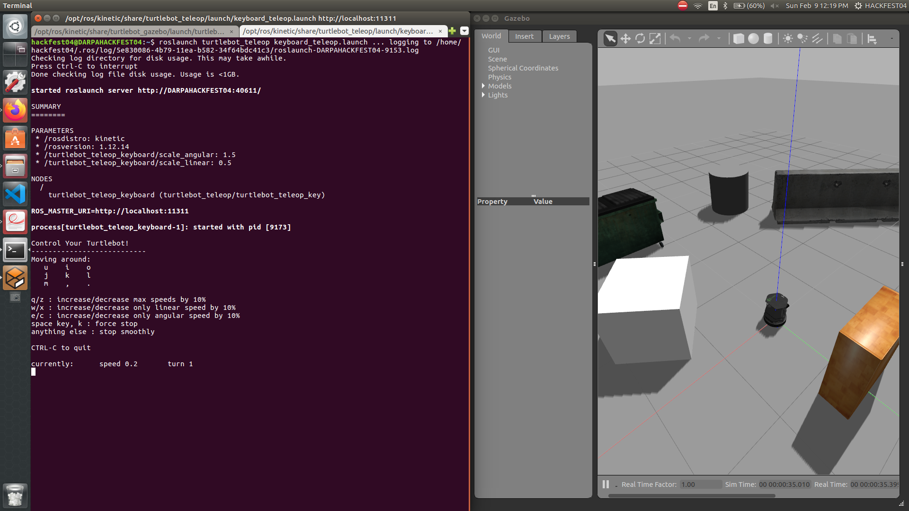
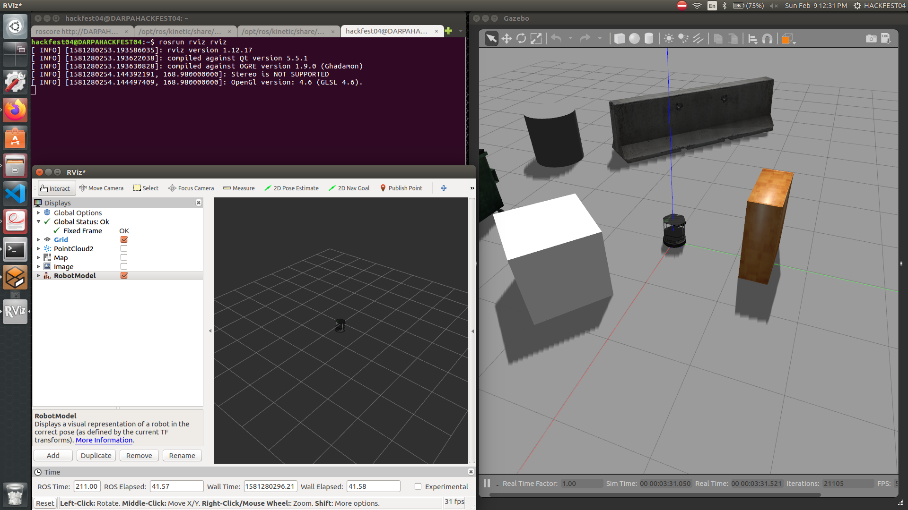
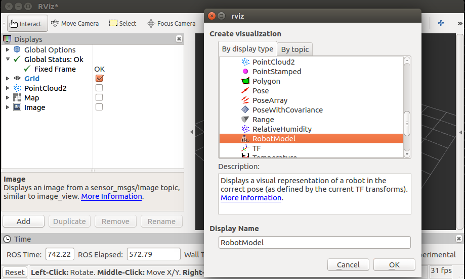

# Getting started with Gazebo and rviz


## Gazebo

ROS integrates closely with Gazebo through the `gazebo_ros` package. This package provides a Gazebo plugin module that allows communication between Gazebo and ROS. Simulated sensor and physics data can stream from Gazebo to ROS, and actuator commands can stream from ROS back to Gazebo. 

Easiest way to run *Gazebo* is just simply type `gazebo` on terminal.



Now let's take an example by simulating a *Turtlebot*. Type the following command in terminal:

> ```sh
> $ roslaunch turtlebot_gazebo turtlebot_world.launch
> ```



In new terminal, type the following to control the *Turtlebot*:
    
> ```sh
> $ roslaunch turtlebot_teleop keyboard_teleop.launch
> ```



To control the robot, click on the terminal where *keyboard_teleop.launch* file is running.

If you don't have a *turtlebot package*, [click here](link) to see the installing instruction.

## rviz

`rviz` stands for ROS visualization. It is a 3D visualization environment for robots. Using `rviz` we can monitor data from simulation from not only from a simulated robot in Gazebo, but also a real robot. Using `rviz`, we can create a map, take a photo and even navigate robots.

First, we will start with `roscore` and then command lines  in *Gazebo section*, where we have two terminals open: for *Turtlebot launch* and the *keyboard driver*. Lastly, to run `rviz`, which is in its own package `rviz`, we use `rosrun`. 
To run `rviz` (all in different terminals):

> ```sh
> $ roscore
> $ roslaunch turtlebot_gazebo turtlebot_world.launch
> $ roslaunch turtlebot_teleop keyboard_teleop.launch
> $ rosrun rviz rviz
> ```



If Turtlebot is showing on `rviz`, press *add* button on rviz and select *RobotModel*.


                    

