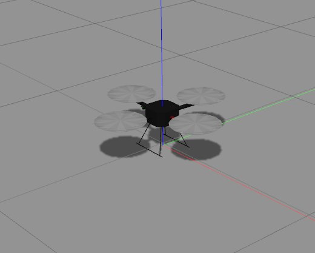

# Hector Quadrotor



## Installation

Unfortunately, there is no binary package for *hector_quadrotor*. Therefore, you need clone the package to your workspace.

### Installation
To install *hector_quadrotor packages*, enter the following commands:

>```sh
> $ cd catkin_ws
> $ git clone https://github.com/tu-darmstadt-ros-pkg/hector_quadrotor.git
>```

Build the catkin workspace as usual and source the new setup.bash:

>```
> $ catkin_make
> $ source devel/setup.bash
>```

### Launching Hector Quadrotor

To launch *hector_quadrotor* in Gazebo:

>```sh
> cd
> source /home/hackfest04/hector_quadrotor/devel/setup.bash
> $ roslaunch hector_quadrotor_gazebo quadrotor_empty_world.launch
>```

### Controlling Hector Quadrotor 

Before controlling *hector_quadrotor*, first enable motors:

>```sh
> $ rosservice call /enable_motors "enable: true"
>```

Then run *teleop_twist_keyboard.py* with `rosrun` command:

>```sh
> $ rosrun teleop_twist_keyboard teleop_twist_keyboard.py
>```
