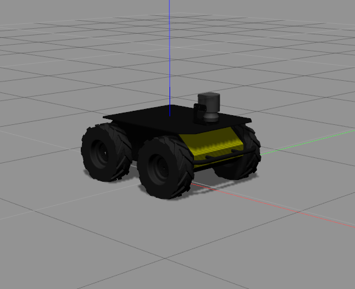

# Husky Rover



## Installation

*Husky Rover* is not included `ros-kinetic-desktop-full`. Therefore, you need to install with the following instrcution.

### Binary Installation
To install *all Husky Rover packages*, enter the below command in *terminal*:

>```sh
> $ sudo apt-get install ros-kinetic-husky-*
>```

NOTE: asterisk (*) stands for all


### Launching Turtlebot

To launch *Husky Rover* in Gazebo:

>```sh
> $ roslaunch husky_gazebo husky_empty_world.launch
>```


### Launching Turtlebot
>```sh
> $ rosrun teleop_twist_keyboard teleop_twist_keyboard.py 
>```
