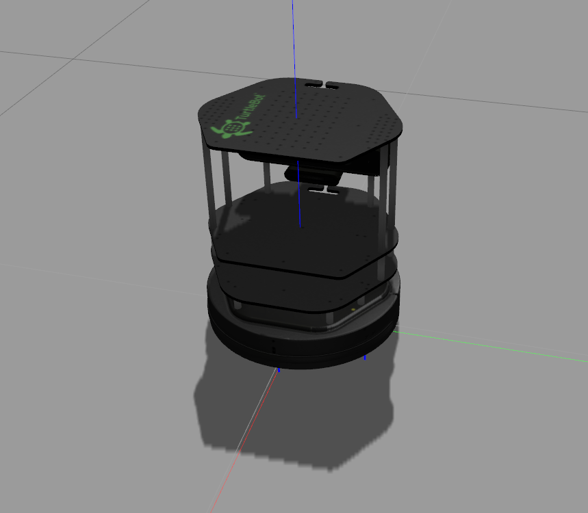

# Turtlebot



## Installation

Usually, *Turtlebot package* is included in `ros-kinetic-desktop-full` package. However, it was missing when I installed metapackage. 

### Binary Installation
To install *all Turtlebot packages*, enter the below command in *terminal*:

>```sh
> $ sudo apt-get install ros-kinetic-turtlebot-*
>```

NOTE: asterisk (*) stands for all


### Launching Turtlebot

To launch *Turtlebot* in Gazebo:

>```sh
> $ roslaunch turtlebot_gazebo turtlebot_world.launch 
>```


### Launching Turtlebot
>```sh
> $ roslaunch turtlebot_teleop keyboard_teleop.launch 
>```
